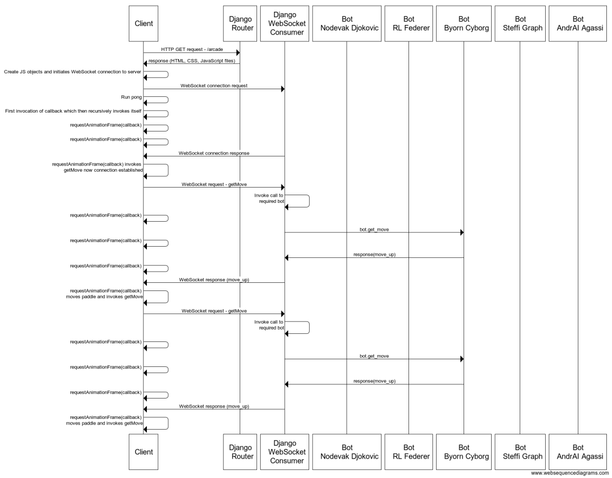

# Pong AI

This was my final project at Makers. As a team, we had 10 days to come up with an idea, and put that idea into practise. After 10 days we had a feature freeze, meaning no additional features were allowed to be added. We then had a further 2 days to refine the program, before presenting to our Academy.

Our idea was to build a Neural Network that learnt to play the classic video game Pong. This Neural Network would then be hosted in the bakend of our program, with the whole App hosted on our own [_webpage_](http://net-positive-pong-ai.herokuapp.com/training/). Here, a user can watch the AI 'train', with it's performance improving over time. The user can also play against 1 of 5 AI's (2 x neural Net, 3 x procedural bots) or, play against another player in the Multiplayer mode.

It was a pleasure working with the team, we came up against many, many hurdles during the 2 week project, but alwats managed to pull together and motivate eachother to continue and succeed. The original repo can be found [_here_](https://github.com/Jakephillips55/Net-Positive-Makers) - Huge shout out to them members Asia, Jake, Nic and Tom.

---

### Neural Networks

The neural networks we used were heavily based on the work done by Andrej Karpathy in his [Reinforcement Learning Blog](http://karpathy.github.io/2016/05/31/rl/). Using this neural network training approach we arrived at our most skilled neural net based Pong bot. His work also provided strong guidance for how a net should interact with the pong game and what values it should receive during training. We added additional logging and checkpointing capabilities to the training code to allow for better visibility during the training process.

This team tried different methods, including biases in the net, making it deeper - with more hidden layers added, and using Adam optimization instead of RMSprop. We found that the simple single layer style, without biases yielded far superior results when compared to the combination of the aforementioned specifications. Nevertheless, our version of the neural net is represented in the game as **Bjorn Cyborg** and its code can be seen in the models section of the project along with Andrej's own Neural net (represented in the game as **Steffi Graph**.)

### Training

The nets were trained over around 15,000 games of Pong using the OpenAI Gym Python library. After this training their forward propagation code and final network weights were ported into our python backend. This allowed the nets to then play our version of the game, which was made to mimic the OpenAI Gym version as far as possible. Our Pong game was built using vanilla JavaScrip on a Canvas element.

Training runs were completed on AWS EC2 instances, we found a C5.2xlarge instance provided a good balance between training speed and cost.

We also added the capability for the neural networks to be trained directly on our own JavaScript version of the game. We did however find that this was to be around 10 times slower than training in the OpenAI Gym, due to the additional latency involved in the websocket communication between the frontend game and backend training code.

---

### Sequence Diagram

Shows the interaction between application components on 'Arcade Mode'



---

## How to Run

Make sure you have a version of Python > 3.4 Then clone this repository, navigate to the directory `Net-Positive-Makers`, and in the command line type:

```
install pip3
```

Then to install the dependancies, in the command line type:

```
 pip3 install -r requirements.txt
```

### Running Locally

From the command line, navigate to the directory `Net-Positive-Makers` and type in:

```
python3 net_positive/manage.py runserver
```

Then open a browser and visit this link [_localhost::8000_](localhost:8000)

### Running Live

See it live on [_Heroku_](http://net-positive-pong-ai.herokuapp.com/training/)

---

## Testing

To test all python directories, navigate to the directory `Net-Positive-Makers` and type in the command line:

```
PYTHONPATH=net_positive/ pytest --ds=net_positive.settings
```

For Javascript tests, run from the command line:

```
jasmine server
```

Visit [_localhost_](http://localhost:8888/) to view the test output.

---

## Arcade Mode


## Training Mode


## Multiplayer Mode


